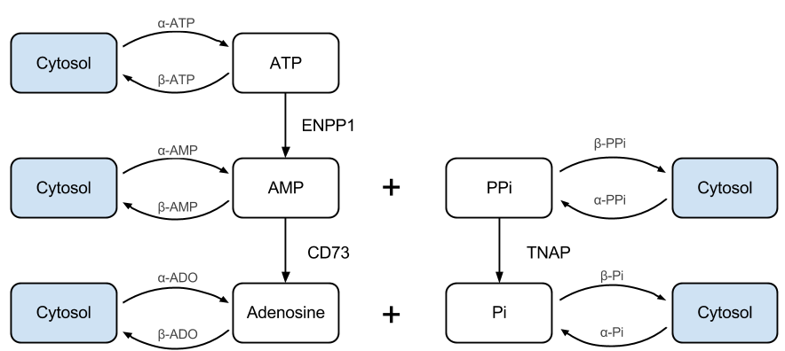

\begin{titlepage}
\begin{center}

% Upper part of the page. The '~' is needed because \\
% only works if a paragraph has started.

\textsc{\LARGE University of Washington}\\[0.1cm]
\textsc{\LARGE Department of Bioengineering}\\[1.5cm]

\textsc{\Large Qualifying Examination}\\[0.5cm]

% Title
{ \LARGE \bfseries A Quantitative Systems Approach for Studying and Treating Arterial Calcification Due to CD73 Deficiency}\\[2.0cm]

\vfill

% Bottom of the page
% Author and supervisor
\begin{minipage}{0.2\textwidth}
\begin{flushleft} \large
\emph{Author:}\\
Stanley \textsc{Gu}
\end{flushleft}
\end{minipage}
\begin{minipage}{0.7\textwidth}
\begin{flushright} \large
\emph{Committee:} \\
Dr.~James \textsc{Bassingthwaighte} (Chair) \\
Dr.~Daniel \textsc{Cook} \\
Dr.~Herbert \textsc{Sauro} (Advisor) \\
Dr.~Paul \textsc{Wiggins} \\
\end{flushright}
\end{minipage}

\vspace{3cm}
{\large May 9, 2013}

\end{center}
\end{titlepage}

\tableofcontents

\newpage

# Abstract and Specific Aims

Vascular calcification in both the intima and media of vessels is associated
with increase risk for cardiac events and mortality. Given the significant
clinical impact of arterial calcification, the mechanism and genetic basis
behind its clinical presentation has been a subject of intense study.

Recently, the human gene *NT53* that encodes CD73, the enzyme responsible for
converting extracellular AMP to adenosine, has been implicated as a key
component behind the metabolic pathway for inhibiting medial vascular
calcification. Individuals with mutations in NT5E result in a disease phenotype
of arterial calcification and distal joint calcification (ACDC). As of the
writing of this proposal, there is no standard treatment or therapy for
alleviating this condition.

This study proposes the development of a quantitative systems model, built
alongside and informed through *in vitro* experimentation, for elucidating the
mechanism behind the ACDC phenotype. This model will enable in-depth
investigation of the medial vascular calcification pathway, consolidation and
validation of the mechanistic understanding of the disease, and identification
and prediction of efficacious new therapeutic interventions, which will be
confirmed experimentally. After establishing a predictive *in silico* model of
the biological mechanism behind ACDC, sensitivity and flux balance analysis
will be used to identify targets within the pathway for therapy, which will be
confirmed in a murine disease model. The general approach in building this
mechanistic model is iterative and hypothesis driven. Experimental results will
serve to tune and build confidence in the proposed mechanisms, leading to
better understanding of the impact due to CD73-deficiency and potential
treatments for the condition.  While beyond the scope of this proposal, the
systems modeling approach introduced here may also prove useful for studying a
number of related diseases stemming from defects within biomolecular components
upstream and down stream of CD73.

## Specific Aim 1: **Develop *In Vitro* Platform for Exploring ACDC Pathway.**

An *in vitro* model consisting of vascular smooth muscle cells, will serve as a
platform for running molecular biology experiments for mechanistic exploration
and model building. Through review of the current literature, several surface
bound enzymes, primarily ENPP1 and TNAP, were identified as major components
contributing to pyrophosphate depletion, leading to mineralization of the
arterial wall, and will also be incorporated in the initial mechanistic
hypothesis. Antibodies will be developed to specifically to bind to each of the
surface proteins of interest, allowing for labeling and quantification of the
enzymes, in addition to serving as a method for inhibiting specific reactions.
This aim will achieve quantification and control over the system that will be
modeled.

## Specific Aim 2:  **Build Quantitative Systems Model of Medial Arterial
Calcification.**

A system of coupled differential equations will be used to mathematically model
the kinetics of the arterial calcification system. The biomolecular
interrogation techniques from Specific Aim 1 will be used experimentally fit
parameters within the model. Enzyme surface expression levels and trafficking
will be determined, as it is important from a modeling perspective to quantify
the total available enzyme levels. Endogenous metabolite generation and
degradation rates will be measured under full blockage of the pathway.  The
kinetics of each enzyme in the system will be measured in insolation by
selectively blocking the activity of other enzymes in the pathway. Parameters
will be fit through standard nonlinear regression techniques and the model will
be built in steps through the incremental coupling of the system components.
Once the full model has been established, uncertainty analysis will be
performed to determine how uncertainty in the model parameters propagates to
uncertainty in the model predictions.

## Specific Aim 3: **Investigate Potential Therapeutic Interventions for
Treating CD73 Deficiency *In Vitro* and *In Silico* Along with Extrapolating
the Results for *In Vivo* Study in an Established Murine Model.**

An *in vitro* and *in silico* disease model will be produced through antibody
blocking of CD73 in cultured cells and removing the CD73 contribution in the
mathematical model. Sensitivity and flux balance analysis will be used to
determine which other parts of the network would be suitable therapeutic
targets for restarting PPi/Pi balance.  An animal model of disease, CD73 -/-
mice, will be used to perform a test of principle for phosphate balance
recovery. Potential therapies include, but is not limited to, bisphosphonates
(a PPi analog), adenosine anaologes, lansoprazole (inhibitor of TNAP), and
dipyridamole (adenosine signaling inhibitor). Therapy selection will be
assisted by *in vitro* and model simulation results.

# Background and Significance

In this section, the scientific context of this biological problem will be
introduced. While the subject of arterial calcification is a large and diverse
field, the focus of this background will be on the biological mechanisms of
interest behind the NT5E mutation phenotype in designing this disease model.
Additional reviews on the pathobiology behind arterial calcification have been
published. [@Demer2008; @Giachelli2004]

## Vascular Calcification

Vascular calcification is the process in which hydroxyapatite mineral deposits
are formed in the walls of blood vessels. Arterial calcification is a
well-defined risk factor in significantly increased patient mortality.
[@Shaw2003; @Chiu2010; @Blacher2001; @London2003] While once thought to be a
passive process of deposition due to elevated electrolyte imbalances in the
blood, vessel calcification has been discovered to be an active process that is
similar to bone formation and remodeling. [@Bostrom1993; @Giachelli1993; @Ding2006]

Calcification can occur in either the media (within vessel walls) or intima
(vessel lumen interior). Intimal vascular calcification (IVC) is frequently
seen in conditions related to atheroschlerosis [@Nakamura2009]. Medial vascular
calcification (MVC), also known as Monckeberg's arteriosclerosis, increases in
prevalence in populations with increased age, diabetes mellitus, chronic kidney
disease, chronic inflammation, and genetic disorders. [@Micheletti2008]

## Arterial Calcification due to Deficiency of CD73 (ACDC)

Ecto-5'-nucleotidase (CD73) is located on the surface of the plasma membrane
and hydrolyzes adenosine monophosphate (AMP) to adenosine. [@Zimmermann1992]
Due to the broad range of AMP and adenosine involvement in biological
processes, CD73 function is implicated in a variety of pathological conditions,
including immunodeficiency [@Deaglio2007], inflammation [@Colgan2006], and
ectopic calcification.

Using a genome-wide homozygosity mapping approach, a popularizing technique in
cardiovascular research [@Kathiresan2012], nonsense, missense, and
single-nucleotide insertion frameshift mutations in the NT5E gene, coding for
CD73, have been discovered to cause MVC of the limbs and joints in otherwise
healthy individuals. [@StHilaire2011] The disease phenontype was exhibited in
patients who were homozygous for the defective gene, with the onset of symptoms
occuring around age 20 and becoming more severe with age, causing significant
pain and discomfort in walking. The study by @StHilaire2011 demonstrated that
cultured fibroblasts from the patients were deficient in CD73 activity of
hydrolyzing AMP into adenosine and inorganic phosphate, which was shown to be
restored through CD73-deliverying viral vectors.

## Exploring Possible Mechanisms Behind ACDC

In determining the mechanism of ACDC, the literature was reviewed for related
enzymes and metabolites that are related in the pathobiology of MVC (Figure
\ref{fig:mechanism}). [@Rutsch2011] The process of bone formation by
osteoblasts is closely resembled by the induced osteoblast-like smooth muscle
cells that cause MVC. [@Neven2011] Insight into the pathological mechanism has
come from numerous independent genetic studies that discovered molecular
defects in rare monogenetic disorders. [@Nitschke2012a]

### Tissue-Nonspecific Alkaline Phosphatase (TNAP)

A key enzyme related to calcification, TNAP, was found to be
significantly overexpressed on the surface of CD73-deficient cells, which could
be reduced to normal levels through adenosine supplementation *in vitro*. TNAP
plays a key regulatory role in maintaining proper levels of inorganic
pyrophosphate ($PP_i$) and phosphate ($P_i$) through the hydrolysis of $PP_i$
into $PP_i$.  [@Millan2006] The ratio of $PP_i$ to $P_i$ is crucial in
controlling the formation of hydroxyapatite (HA) crystal [@Lomashvili2004], one
of the primary constituents of bone and product of arterial calcification.
$PP_i$ inhibits the deposition of $P_i$ and calcium on to growth sites in HA
crystals, when $PP_i$ levels fall to abnormal levels, ectopic calcification
results.  [@Narisawa2004;@Hessle2002] 

The under-expression of TNAP activity also has deleterious effects. In both
humans [@Henthorn1992] and mice [@Anderson2004] with defects in TNAP
expression, the result is fatality shortly after birth. In the TNAP knockout
mice, there was normal formation HA containing matrix vesicles that are
released by osteoblasts, however, extracellular mineralization was impaired due
to elevated $PP_i$ levels (Figure \ref{mice-tnap-knockout}).

![\label{mice-tnap-knockout}Impaired bone formation of TNAP knockout mice (B)
compared to wildtype mice (A). [@Anderson2004]](images/mice-tnap-knockout.png)

[@Markello2011]: Vascular pathology of medial arterial calcifications in NT5E deficiency: implications for the role of adenosine in pseudoxanthoma elasticum.

### Ectonucleotide Pyrophosphatase/Phosphodiesterase 1 (ENPP1) and ANK

The tiptoe-walking mouse (*ttw/ttw*) was used for many years as a disease model
to study calcification of ligaments. @Okawa1998 showed that the
phenotype was due to a mutation in the gene encoding for ENPP1. ENPP1 is a
major physiological generator of extracellular $PP_i$ by hydrolyzing ATP.
[@Kato2012] The loss the capacity for $PP_i$ to potently inhibit HA formation
results in severe MVC beginning in infancy. ENPP1 knockout mice recapitulated
the *ttw/ttw* phenotype and Consequently, defects in ENPP1 for humans were
discovered to cause generalized arterial calcification of infancy (GACI).
Treatment with bisphosphonates [@Ramjan2009], a pyrophosphate analog, can
reverse the course of disease. Interestingly, it has been shown that stopping
bisphosphonate supplementation at the age of 2 in infants still allows for
healthy development [@Edouard2011], which is perhaps a result of other
compensatory mechanisms for maintaining systemic balance of $PP_i$/$P_i$.

Mutations in the gene ANKH (ANK in mice) also result in a similar disease
phenotype  [@Nurnberg2001]. ANKH is the other contributor of $PP_i$ in the
extracellular environment, through the transport of intracellular $PP_i$.

[@Kiffer-Moreira2013]: Pharmacological Inhibition of PHOSPHO1 Suppresses Vascular Smooth Muscle Cell Calcification

[@Roberts2005]: Probing the substrate specificities of human PHOSPHO1 and PHOSPHO2. Have a wide spectrum of phosphorylated compounds that are hydrolyzed. PHOSPHO2 hydrolyze ATP and pyrophosphate

[@Hoemann2009]: In vitro osteogenesis assays: Influence of the primary cell source on alkaline phosphatase activity and mineralization
[@Hotton1999]: Differential Expression and Activity of Tissue-nonspecific Alkaline Phosphatase (TNAP) in Rat Odontogenic Cells In Vivo
Phosphate
[@Jono2000]: Phosphate Regulation of Vascular Smooth Muscle Cell Calcification - in vitro assays

### ATP-binding Cassette Sub-Family C Member 6 (ABCC6) and Role of Adenosine Signaling

@StHilaire2011 discovered that by supplementing CD73 deficient cells with
adenosine, TNAP overexpression can be brought back down to normal levels, and
subsequently the levels of calcification detected *in vitro* were notably
reduced. This finding suggests that delivering adenosine, which is the missing
product from CD73, may lead to the rescue of the ACDC condition
[@Rutsch2011;@Nitschke2012]. Dysfunctional adenosine production was also
suggested to be the consequence of ATP-binding Cassette Sub-Family C Member
(ABCC6) mutations [@Markello2011] that cause pseudoxanthoma elasticum (PXE), a
disease that shares similar manifestations to ACDC [@LeSaux2000]. However,
later studies [@Leftheriotis2011;@LeSaux2012] showed that ABBC6 does not
transport adenosine, and suggests that its role may be more complex. Evidence
shows that a yet to be discovered substrate, or substrates, is transported
systemically into serum, which prevents ectopic calcification. [@LeSaux2006]
Interestingly, mutations in ENPP1 or ABCC6 can lead to PXE symptoms [@Nitschke2012], which further suggests that the mechanisms behind these diseases are inter-related.

Focusing back on the adenosine-supplementation recovery in CD73-deficient
cells, the mechanism in which adenosine apparently suppresses TNAP is not yet
known. All adenosine receptors are G-Protein Coupled Receptors (GPCR), are one
of four different pharmacological classes ($A_1$, $A_{2A}$, $A_{2B}$, and
$A_3$), and have a wide range of effects on the body. [@Hasko2008]

[@Delomenede2009]: Lansoprazole is an uncompetitive inhibitor of tissue-nonspecific alkaline phosphatase (TNAP)

[@O'Neill2010]: Recent progress in the treatment of vascular calcification. Suggests the control of phosphates for treatment

[@Abedin2004]: Review of arterial calcification and mechanisms behind it. Vascular calcification may include both osteogenic and chondrogenic differentiation. In humans, it is primarily osteogenic with bone tissue formation, whereas in mice, it is primarily chondrogenic with cartilage formation. 

[@Koszalka2004]: CD73 -/- Mice

[@Bhalla2004]: Review of the different types of cell signaling models

[@Fisher2007]: Review of the difference between two types of modeling, mathematical and computational. 

[@Chen1999]: Modeling gene expression with differential equations.

[@Gutenkunst2007]: Systems biology models are universally "sloppy", meaning
they that they contain many insensitive parameters and their behaviors are
determined by relatively few number of stiff parameters.

[@Marino2008]: A methodology for performing global uncertainty and sensitivity analysis in systems biology.

[@Aldridge2006]: Physicochemical modelling of cell signalling pathways. Lauffenburger review article

[@Eicher2012]: Determining Enzyme Kinetics for Systems Biology with Nuclear Magnetic Resonance Spectroscopy

# Experimental Design and Methods
## Overview

Figure \ref{fig:overview} shows an overview of the specific aims.

Specific Aims 1 and 2 will serve to explore the mechanism behind ACDC and will
be performed in parallel. The results from the *in vitro* and *in silico*
modeling will be used to inform each process.

Specific Aims 2 and 3 will serve to intelligently select and design for a
therapeutic intervention for treating the disease. Analysis of the optimized
*in silico* model will enable the selection of the best therapeutic
intervention to be tested in a CD73 -/- mouse model.

## General Protocols

## Specific Aim 1
### Strategy and Rationale

While review of the literature has a provided a thus far consistent hypothesis,
based on PP~i~ depletion caused adenosine, signal disruption that is proposed
here, Aim 1 will pursue further molecular biology experiments to support or
invalidate the working model.

Proposed mechanism shown in Figure \ref{fig:mechanism}.

### Experimental Plan

#### Establish *In Vitro* Model of ACDC and Healthy Controls

Vascular smooth muscle cells (VSMCs) will be isolated and cultured
[@mahabeleshwar2007methods] from distal arteries of C57BL/6J mice. Medial
tissues will be separated from surgically excised vasculature. [@Jono2000]
Small pieces of tissue (1 to 2 mm^3^) will be digested overnight in DMEM
supplemented collagenase type I, elastase type III, and soybean trypsin
inhibitor at 37^$\circ$^ C. The single cell suspensions will then be cultured
for several weeks in DMEM supplemented with fetal bovine serum (FBS). The
purity of the cultures will be assessed by immunostaining for $\alpha$-actin
and calponin, positive indicators for smooth muscle cells. [@Liaw1995] VSMCs
will be routinely subcultured in growth medium. For running experiments, VSMCs
will be grown to confluency, trypsinized, counted (Invitrogen Automated Cell
Counter), and redispersed on to microtiter plates. These cells will serve as
the health control VSMCs.

CD73 -/- knockout mice will be purchased from The Jackson Laboratory
(<http://jaxmice.jax.org/>) which contain mutations in the NT5E/CD73 gene
coding for the enzyme's catalytic site. [@Knofel1999] This same mouse model
will be the *in vivo* CD73 -/- model used in Aim 3. VSMCs will be isolated and
cultured from this knockout model in a similar procedure as above.

[@Castrop2004]: CD73 mice sacrificed at 4-6 months, showed significantly elevated plasma alkaline phosphatase levels, consistent with the mechanism and suggests that the ACDC phenotype may be expressed
[@Jono2000]: Quantification of calcification. Treatment of HSMC with phosphate. Immortal HSMC. Causes differentiation

##### Expected Results and Proposed Alternatives

While VSMC cell cultures have previously been established from *ex vivo* human
aorta [@Jono2000], the similar process in mouse VSMC cell culture may be
difficult due to the drastically smaller amount of "seed" tissue that can be
extracted from each specimen to start the colony. Collecting tissue from
multiple specimens may be necessary to initiate a sustainable culture. Other
cell types may be used for *in vitro* experiments, @StHilaire2011 used human
fibroblasts directly from CD73 -/- patients. However, the selection of mouse
VSMCs that come from the same mouse strain is desired because it will likely be
the closest relationship between cell dish experiments to whole animal across
the experimental aims.

#### Quantify Surface Enzyme Expression

The relative expression levels of ENPP1, CD73, and TNAP will be determined
through Western blot and real-time polymerase chain reaction (qPCR). These
measures will create an expression-level profile of healthy and ACDC VSMCs.
Cells will be trypsinized, lysed in the presence of protease inhibitor (Roche),
centrifuged, and the supernatent protein quantified via the bicinchoninic acid
assay (Pierce). A fixed amount of protein will be mixed with SDS protein gel
loading solution, run on a 4-20% polyacrylamide gel, and electrophoresed at
120V for 1.5 hours. After the transfer of proteins, antibodies against ENPP1,
CD73, TNAP, and actin (baseline) will be used for quantification.

RNA will be isolated from VSMCs through the use of the RNeasy kit (Qiagen), and
complimentary DNA for each of the three enzymes, along with 18S RNA as a qPCR
normalizer. Expression levels will be calculated by comparing the cycling
threshold compared with the normalizer (PCR Detection System, BioRad).

ENPP1 and TNAP enzyme activity on the cell surface will be assayed using
colorimetric substrates, p-nitrophenyl thymidine 5'-monophosphate and nitro
blue tetrazolium/5-bromo-4-chloro-3-indolyl phosphate, respectively (Sigma).
[@Nam2011] After one hour incubation, the ENPP1 reaction will be stopped by
addition of NaOH, and the absorbance through the well measured at 405 nm. The
TNAP reaction will be stopped by washing with H~2~O and air drying. TNAP
activity will be quantified via microscopic densitometry with image analysis
software. CD73 activity will be quantified as according to @StHilaire2011.
VSMCs will be washed with 2 mM magnesium chloride, 120 mM sodium chloride, 5 mM
potassium chloride, 10 mM glucose, and 20 mM HEPES. Incubation buffer,
consisting of the wash solution supplemented with 2 mM AMP, will be added, and
the cells incubated at 37^$\circ$^ C for 10 minutes. Inorganic phosphate will
be measured with the SensoLyte MG Phosphate Assay Kit (AnaSpec). Inorganic
phosphate measurements will be normalized to protein levels.

##### Expected Results and Proposed Alternatives

The expression levels of TNAP will be expected to be much higher than normal,
which was shown in fibroblasts by @StHilaire2011. Functional CD73 levels should
be non-existent in the NT5E mutant cells. The working hypothesis of this
proposal is that adenosine signaling is significantly reduced by the lack of
CD73 function, which expression inhibition of TNAP. ENPP1 levels have not been
reported to change with CD73 mutation, so any differences in expression would
be an interesting finding, as it may indicate that the excessive extracellular
AMP that is left unconsumed by CD73 may play a role signaling role as well.
While AMP has mostly been reported as merely a precursor to adenosine
signaling, orphan GPCRs have been discovered [@Inbe2004] that can respond to
both AMP and adenosine.

The enzyme RNA expression levels are expected to correspond with extracellular
activity. Discrepancies in these measures may indicate that adenosine signaling
has some effect on surface protein recycling or expression. These measurements
may be taken again during adenosine agonist addition to further investigate.

#### Establish Extracellular Metabolite Profile of ACDC Versus Disease Cells

The substrates and products in the hypothesized metabolic pathway involved in
ACDC are ATP, AMP, ADO, PPi, and Pi. Steady state metabolite profiles of ACDC
and control cell types will provide insight to the pathobiology of this
condition. MVC occurs through HA crystal formation, which is dependent on
extracellular concentrations of chemical species, namely PP~i~.

Cell cultures will be allowed to reach steady state metabolite levels over 24
hours after media change. Sequential readings will be taken to ensure that 24
hours is sufficient time to reach steady state values.

Nucleotides ATP, AMP, and ADO will be measured using high-performance liquid
chromatography (HPLC) as described in @Ciancaglini2010.  PP~i~ will be measured
enzymatically [@Lomashvili2004] by sampling the extracellular media. As in the
CD73 activity assay, P~i~ will be measured using the SensoLyte MG Phosphate
Assay Kit (AnaSpec).

##### Expected Results and Proposed Alternatives

One of the key metabolite levels to be determined is PP~i~. The working
hypothesis is that ACDC is the result of depressed PP~i~ due to increased TNAP
expression. It has been shown that healthy *ex vivo* rat VSMCs after 3 days of
culture generate PP~i~ endogenously to reach a level of 0.44 $\mu$M in medium,
without any addition of PP~i~. [@Lomashvili2004] Depletion of PP~i~ resulted in
spontaneous calcification. In injured aortic cultures, higher levels of
pyrophosphate, 5-10 $\mu$M was shown to inhibit calcification, although these
high levels necessary for calcification inhibition is likely necessary due to
increased TNAP expression in injured tissue. In healthy humans, 3.26 +/- 0.17
$\mu$M serum levels of PP~i~ were measured. [@Lomashvili2005] Thus, it will be
expected that normal VSMCs will equilibrate with the media at around 1 $\mu$M
PP~i~, whereas CD73 -/- VSMCs will be significantly less. Failing to find
decreased levels of PP~i~ could suggest that disrupted regulator of
mineralization could be a different HA inhibitor, such as osteopontin.
[@Sapir-Koren2011]

Differences in other metabolite concentrations would suggest other compensatory
mechanisms are upregulated and could direct further experiments to shed light
on the discrepancy.

##### Combinatorial Probing of Adenosine Receptors with Agonists

One of the key goals in this Aim is to elucidate the adenosine signaling
mechanism for regulating TNAP expression. There are four pharmacological
classes of adenosine receptors (ARs), A~1~, A~2A~, A~2B~, and A~3~. Toward the
goal of developing a potential therapeutic by replacement of the missing
adenosine signal, and to understanding the biological repercussions and
potential off-target effects, it is necessary to identify the specific
AR which, when activated, inhibits TNAP expression.

A combinatorial approach of activating a single type of adenosine receptor,
while inhibiting all others, will be used. Four adenosine receptor agonists
(ARAs) will be selected, CPA, CGS21680, BAY 60-6583, and IB-MECA, and four
adenosine receptor antagonists (ARANTs) DPCPX, CSC, MRS1754, and MRS1220, will
be used to selectively investigate A~1~, A~2A~, A~2B~, and A~3~ effects on TNAP
expression, respectively. [@Hasko2008] Each ARA will be incubated at its EC90
value in a microtiter plate with three ARANTs onboard, at their IC90 values,
for the other AR types. This will be performed for control and CD73 -/- VSMCs.
TNAP activity levels will be quantified at time 0, 12 hours, 1 day, 3 days, and
5 days.

##### Expected Results and Proposed Alternatives

ARs have a wide range of physiological effects when stimulated. Identifying the
specific activation site for TNAP repression will greatly aid in the
development of a treatment for ACDC. While it is possible that any of the four
ARs may be responsible for a signal cascade that regulates TNAP, A~2B~ is
probably an unlikely candidate as it a low affinity AR, and is usually only
triggered at extremely high physiological levels of adenosine release, such as
in the case of cell apoptosis. A~1~ and A~3~ decrease whereas A~2~ increases
intracellular cAMP. Tying TNAP expression to cAMP will add it a long list of
regulatory functions of cAMP.

Since AR siginaling is an active field of study for many biomedical
indications, there is a plethora of ARAs and ARANTs that may be used as
alternatives if there are difficulties in eliciting a response measured by TNAP
repression. In the event there is no response from ARAs, the next step in the
experimental plan is to explore other mechanisms where ADO can affect enzyme
expression.

##### Search for Additional Adenosine Signaling Mechanisms

If TNAP regulation is controlled by a means other than through the four known
ARs, it is possible that either transport of adenosine directly into the
cytosol via SLC29 is the mechanism of action or through agonism of a yet to be
identified receptor. To explore these possibilities, VSMCs will be incubated
with inhibitors of all known ARs at high enough concentrations to reasonably
block any adenosine binding to them. Then, cells will be incubated with or
without dipyridamole, an inhibitor of adenosine uptake. TNAP expression will be
measured at time 0, 12 hours, 1, 3, and 5 days.

##### Expected Results and Proposed Alternatives

If TNAP suppression is observed in the absence of dipyridamole, and not in its
presence, this would suggest that it is the direct transport of adenosine into
the cell that is the ultimate fate of CD73 produced adenosine in regulating
TNAP. If TNAP suppression is observed equally withough regard to dipyridamole,
it would suggest that another unknown adenosine receptor is being triggered.

A possibly more exotic result is the lack of any response after blocking the
four known AR classes. It could be that combination of two or more AR triggers
are necessary for TNAP regulation.

## Specific Aim 2

### Strategy and Rationale

This Aim will guide the rational design of three potential therapies for treating
ACDC. The strategy that will be adopted in this aim is to create useful PK-PD
models that encompass three different pharmacological approaches to reducing
MVC. The three different drug approaches are AR signaling, TNAP inhibition,
PP~i~ supplementation with bisphosphonates. A combination of *in vitro* assays
to determine drug PD along with *in vivo* measurements to determine PK.

This modeling approach will be immensely useful for simulating treatment plan
efficacy of these three different drug classes. Furthermore, experimentation
will be done to to create interaction PK-PD models to evaluate the efficacy of
combination therapies. Since these three drug classes have different mechanism
of actions, it is hopeful that a combination therapy may yield a synergistic
effect on efficacy while minimizing safety risk due to different disposal
pathways.

PD is the study of the effect a drug has on a biological system, as opposed to
PK, which focuses on the effect the body has on the drug. In building a PD
model, the general approach will be to design a methodology for deliverying
dosages at different concentrations and select a way to measure its effect. One
common way to model this relationship between dose and drug effect is using the
Hill Equation (Equation \ref{eq:hill}), where $E$ is the observed drug effect,
$E_{max}$ is the maximum observable drug effect, $C$ is the drug concentration,
and $n$ is the cooperativeity coefficient.

\begin{equation}\label{eq:hill}
E = \frac{E_{max}C^n}{EC_{50}+C^n}
\end{equation}

This PD dose-effect model will be directly coupled with the concentrations in
the effect compartment within a PK model. The general modeling approach that is
adopted in this proposal is to start as simple as reasonable and expand in
response to new data that suggests a more complicated system would be
appropriate. A single compartment PK model would be used as a starting point,
however, ACDC symptoms manifest in the peripheral regions of patients, which
suggest that perhaps a two-compartment model may be used if it significantly
fits the experimental data better (Figure \ref{fig:pkpd}).

### Experimental Plan

#### Develop Pharmacodynamic Model

##### Adenosine Receptor Agonist

##### Lanzoprazole

##### Bisphosphonate

##### Expected Results and Proposed Alternatives

#### Develop Pharmacokinetic Model

##### Expected Results and Proposed Alternatives

#### Develop Pharmacokinetic-Pharmacodynamic Model

### Expected Results and Proposed Alternatives

## Specific Aim 3
### Strategy and Rationale

[@Castrop2004]: CD73 mice sacrificed at 4-6 months, showed significantly elevated plasma alkaline phosphatase levels, consistent with the mechanism and suggests that the ACDC phenotype may be expressed

### Experimental Plan

#### Establish ACDC Mouse Model

#### Conduct Predicted Dosing Plan on Mouse Model and Evaluate Efficacy

### Expected Results and Proposed Alternatives

# Summary and Future Directions Treatment of CD73-defiency with bisphosphonates
may also have an added advantage for reducing the effects of osteoporosis-like
trabecular bone weakening, which has been found in CD73 -/- mice
[@Takedachi2012]. However, this has not yet been reported in humans.

# Exam Question

William Gahl, the NIH sleuth who has identified a number of rare diseases,
recently found that deletion of the gene NT5E led to calcification in leg
arteries, to arterial insufficiency, and to inability to walk. The gene codes
for an ecto-5'-nucleotidase, CD73. Write a proposal to support research to
define the mechanisms by which the genetic abnormality causes the disease, and
to find out how one can treat the disease. (St.Hilaire C, Ziegler SG, Markello
TC, Brusco A, Groden C, Gill F, Carlson-Donohoe H, Lederman RJ, Chen MY, Yang
D, Siegenthaler MP, Arduino C, Mancini C, Freudenthal B, Stanescu HC, Zdebik
AA, Chaganti RK, Nussbaum RL, Kleta R, Gahl WA, and Boehm M. NT5E mutations and
arterial calcifications. New Eng J Med 364: 432-442, 2011.)

# References

