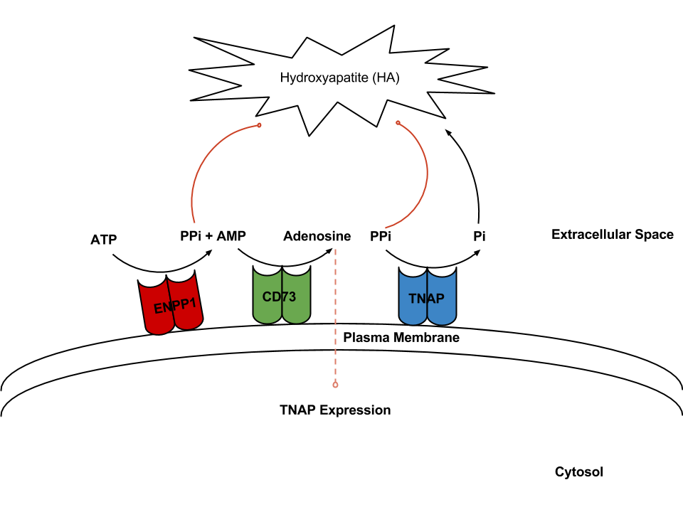
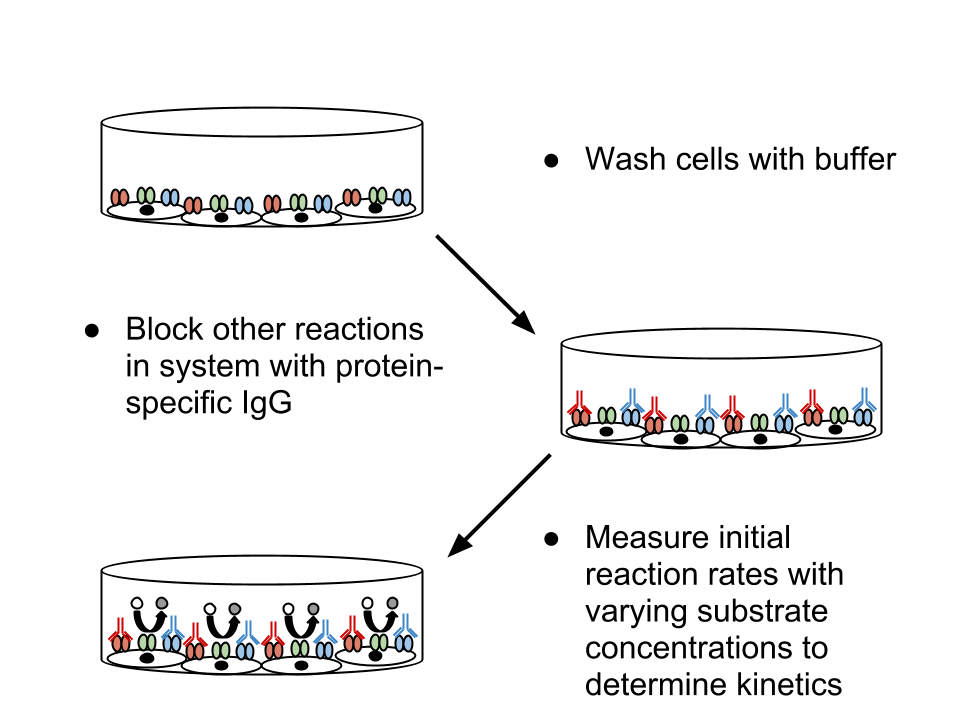

\begin{titlepage}
\begin{center}

% Upper part of the page. The '~' is needed because \\
% only works if a paragraph has started.

\textsc{\LARGE University of Washington}\\[0.1cm]
\textsc{\LARGE Department of Bioengineering}\\[1.5cm]

\textsc{\Large Qualifying Examination}\\[0.5cm]

% Title
{ \LARGE \bfseries A Quantitative Systems Approach for Studying and Treating Arterial Calcification Due to CD73 Deficiency}\\[2.0cm]

\vfill

% Bottom of the page
% Author and supervisor
\begin{minipage}{0.2\textwidth}
\begin{flushleft} \large
\emph{Author:}\\
Stanley \textsc{Gu}
\end{flushleft}
\end{minipage}
\begin{minipage}{0.7\textwidth}
\begin{flushright} \large
\emph{Committee:} \\
Dr.~James \textsc{Bassingthwaighte} (Chair) \\
Dr.~Daniel \textsc{Cook} \\
Dr.~Herbert \textsc{Sauro} (Advisor) \\
Dr.~Paul \textsc{Wiggins} \\
\end{flushright}
\end{minipage}

\vspace{3cm}
{\large May 9, 2013}

\end{center}
\end{titlepage}

\tableofcontents

\newpage

# Abstract and Specific Aims

Vascular calcification in both the intima and media of vessels is associated
with increase risk for cardiac events and mortality. Given the significant
clinical impact of arterial calcification, the mechanism and genetic basis
behind its clinical presentation has been a subject of intense study.

Recently, the human gene *NT53* that encodes CD73, the enzyme responsible for
converting extracellular AMP to adenosine, has been implicated as a key
component behind the metabolic pathway for inhibiting medial vascular
calcification. Individuals with mutations in NT5E result in a disease phenotype
of arterial calcification and distal joint calcification (ACDC). As of the
writing of this proposal, there is no standard treatment or therapy for
alleviating this condition.

This study proposes the development of a quantitative systems model, built
alongside and informed through *in vitro* experimentation, for elucidating the
mechanism behind the ACDC phenotype. This model will enable in-depth
investigation of the medial vascular calcification pathway, consolidation and
validation of the mechanistic understanding of the disease, and identification
and prediction of efficacious new therapeutic interventions, which will be
confirmed experimentally. After establishing a predictive *in silico* model of
the biological mechanism behind ACDC, sensitivity and flux balance analysis
will be used to identify targets within the pathway for therapy, which will be
confirmed in a murine disease model. The general approach in building this
mechanistic model is iterative and hypothesis driven. Experimental results will
serve to tune and build confidence in the proposed mechanisms, leading to
better understanding of the impact due to CD73-deficiency and potential
treatments for the condition.  While beyond the scope of this proposal, the
systems modeling approach introduced here may also prove useful for studying a
number of related diseases stemming from defects within biomolecular components
upstream and down stream of CD73.

## Specific Aim 1: **Develop *In Vitro* Platform for Exploring ACDC Pathway.**

An *in vitro* model consisting of vascular smooth muscle cells, will serve as a
platform for running molecular biology experiments for mechanistic exploration
and model building. Through review of the current literature, several surface
bound enzymes, primarily ENPP1 and TNAP, were identified as major components
contributing to pyrophosphate depletion, leading to mineralization of the
arterial wall, and will also be incorporated in the initial mechanistic
hypothesis. Antibodies will be developed to specifically to bind to each of the
surface proteins of interest, allowing for labeling and quantification of the
enzymes, in addition to serving as a method for inhibiting specific reactions.
This aim will achieve quantification and control over the system that will be
modeled.

## Specific Aim 2:  **Build Quantitative Systems Model of Medial Arterial
Calcification.**

A system of coupled differential equations will be used to mathematically model
the kinetics of the arterial calcification system. The biomolecular
interrogation techniques from Specific Aim 1 will be used experimentally fit
parameters within the model. Enzyme surface expression levels and trafficking
will be determined, as it is important from a modeling perspective to quantify
the total available enzyme levels. Endogenous metabolite generation and
degradation rates will be measured under full blockage of the pathway.  The
kinetics of each enzyme in the system will be measured in insolation by
selectively blocking the activity of other enzymes in the pathway. Parameters
will be fit through standard nonlinear regression techniques and the model will
be built in steps through the incremental coupling of the system components.
Once the full model has been established, uncertainty analysis will be
performed to determine how uncertainty in the model parameters propagates to
uncertainty in the model predictions.

## Specific Aim 3: **Investigate Potential Therapeutic Interventions for
Treating CD73 Deficiency *In Vitro* and *In Silico* Along with Extrapolating
the Results for *In Vivo* Study in an Established Murine Model.**

An *in vitro* and *in silico* disease model will be produced through antibody
blocking of CD73 in cultured cells and removing the CD73 contribution in the
mathematical model. Sensitivity and flux balance analysis will be used to
determine which other parts of the network would be suitable therapeutic
targets for restarting PPi/Pi balance.  An animal model of disease, CD73 -/-
mice, will be used to perform a test of principle for phosphate balance
recovery. Potential therapies include, but is not limited to, bisphosphonates
(a PPi analog), adenosine anaologes, lansoprazole (inhibitor of TNAP), and
dipyridamole (adenosine signaling inhibitor). Therapy selection will be
assisted by *in vitro* and model simulation results.

# Background and Significance

In this section, the scientific context of this biological problem will be
introduced. While the subject of arterial calcification is a large and diverse
field, the focus of this background will be on the biological mechanisms of
interest behind the NT5E mutation phenotype in designing this disease model.
Additional reviews on the other facets of the pathobiology behind arterial
calcification have been published. [@Demer2008; @Giachelli2000; @Giachelli2004]

## Vascular Calcification

Vascular calcification is the process in which hydroxyapatite mineral deposits
are formed in the walls of blood vessels. Arterial calcification is a
well-defined risk factor in significantly increased patient mortality.
[@Shaw2003; @Chiu2010; @Blacher2001; @London2003] While once thought to be a
passive process of deposition due to elevated electrolyte imbalances in the
blood, vessel calcification has been discovered to be an active process that is
similar to bone formation and remodeling. [@Bostrom1993; @Giachelli1993]

Calcification can occur in either the media (within vessel walls) or intima
(vessel lumen interior). Intimal calcification is frequently seen in conditions
related to atheroschlerosis [@Nakamura2009]. Medial calcification, also known
as Monckeberg's arteriosclerosis, increases in prevalence in populations with
increased age, diabetes mellitus, chronic kidney disease, chronic inflammation,
and genetic disorders. [@Micheletti2008]

## Arterial Calcification due to Deficiency of CD73 (ACDC)

Ecto-5'-nucleotidase (CD73) is located on the surface of the plasma membrane
and hydrolyzes adenosine monophosphate (AMP) to adenosine. [@Zimmermann1992]
Due to the broad range of AMP and adenosine involvement in biological
processes, CD73 function is implicated in a variety of pathological conditions,
including immunodeficiency [@Deaglio2007], inflammation [@Colgan2006], and
ectopic calcification. Nonsense mutations in the NT5E gene, coding for CD73,
have been discovered to cause medial arterial calcification of the limbs, in
otherwise healthy individuals. [@StHilaire2011] 

[@Markello2011]: Vascular pathology of medial arterial calcifications in NT5E deficiency: implications for the role of adenosine in pseudoxanthoma elasticum.

[@Collin-Osdoby2004]: Regulation of calcification by RANKL and
osteoprotegerin

[@Kathiresan2012]: Genetics of Human Cardiovascular Disease

[@Ding2006]: Fibronectin Enhances In Vitro Vascular Calcification by Promoting Osteoblastic Differentiation of Vascular Smooth Muscle Cells Via ERK Pathway

## Mechanisms Behind Medial Arterial Calcification

[@Neven2011]: Cell biological and physicochemical aspects of arterial calcification - review of medial arterial calcification. good diagram
[@Jono2000]: quantification of calcification. treatment of HSMC with phosphate. Immortal HSMC. Causes differentiation

[@Addison2007]: pyrophosphate inhibits mineralization through  three mechanisms - binding to mineral, upregulating Opn and decreasing expression of TNAP

Whole Mechanism:
[@Nitschke2012a]: Genetics in arterial calcification: lessons learned from rare diseases. General review and also includes PIT2
[@Rutsch2011]: Genetics in arterial calcification: pieces of a puzzle and cogs in a wheel. 

### Tissue Non-specific Alkaline Phosphatase (TNAP)

[@Henthorn1992]: Different missense mutations at the tissue-nonspecific alkaline phosphatase (TNAP) gene locus in autosomal recessive inherited forms of mild and severe hypophosphatasia
[@Hessle2002]: Tissue-nonspecific alkaline phosphatase and plasma cell membrane glycoprotein-1 are central antagonistic
regulators of bone mineralization
[@Hoemann2009]: In vitro osteogenesis assays: Influence of the primary cell source on alkaline phosphatase activity and mineralization
[@Hotton1999]: Differential Expression and Activity of Tissue-nonspecific Alkaline Phosphatase (TNAP) in Rat Odontogenic Cells In Vivo
Phosphate
[@Jono2000]: Phosphate Regulation of Vascular Smooth Muscle Cell Calcification - in vitro assays

### Ectonucleotide Pyrophosphatase/Phosphodiesterase 1 (ENPP1)
[@Kato2012]: Crystal structure of Enpp1, an extracellular glycoprotein involved in bone mineralization and insulin signalin

### Generalized Arterial Calcification of Infancy (GACI)
[@Ramjan2009]: Treatment with bisphosphonates for 3 years reverses its effects.
[@Edouard2011]: May not be necessary to treat infants with bisphosphonates for even two years.

### Phosphoethanolamine/Phosphocholine Phosphatase (PHOSPHO 1) and Pyridoxal Phosphate Phosphatase (PHOSPHO2)

[@Kiffer-Moreira2013]: Pharmacological Inhibition of PHOSPHO1 Suppresses Vascular Smooth Muscle Cell Calcification

[@Roberts2005]: Probing the substrate specificities of human PHOSPHO1 and PHOSPHO2. Have a wide spectrum of phosphorylated compounds that are hydrolyzed. PHOSPHO2 hydrolyze ATP and pyrophosphate

### ATP-binding Cassette Sub-Family C Member 6 (ABCC6)

[@LeSaux2006]: Serum Factors from Pseudoxanthoma Elasticum Patients Alter Elastic Fiber Formation In Vitro
[@LeSaux2012]: The molecular and physiological roles of ABCC6: more than meets the eye

### Pseudoxanthoma elasticum (PXE)
[@Nitschke2012]: Generalized arterial calcification of infancy and pseudoxanthoma elasticum can be caused by mutations in either ENPP1 or ABCC6

### Potential Therapeutical Interventions

[@Delomenede2009]: Lansoprazole is an uncompetitive inhibitor of tissue-nonspecific alkaline phosphatase (TNAP)

[@Hasko2008]: Adenosine receptors: therapeutic aspects for inflammatory and immune diseases

[@O'Neill2010]: Recent progress in the treatment of vascular calcification. Suggests the control of phosphates for treatment

## Animal Models
[@Abedin2004]: Review of arterial calcification and mechanisms behind it. Vascular calcification may include both osteogenic and chondrogenic differentiation. In humans, it is primarily osteogenic with bone tissue formation, whereas in mice, it is primarily chondrogenic with cartilage formation. 
[@Koszalka2004]: CD73 -/- Mice

## Quantitative Systems Modeling in Biology

### Modeling Techniques

[@Bhalla2004]: Review of the different types of cell signaling models

[@Fisher2007]: Review of the difference between two types of modeling, mathematical and computational. 

[@Chen1999]: Modeling gene expression with differential equations.

[@Gutenkunst2007]: Systems biology models are universally "sloppy", meaning they that they contain many insensitive parameters and their behaviors are determined by relatively few number of stiff parameters.

[@Marino2008]: A methodology for performing global uncertainty and sensitivity analysis in systems biology.

[@Aldridge2006]: Physicochemical modelling of cell signalling pathways. Lauffenburger review article

### Enzyme Kinetics

[@Eicher2012]: Determining Enzyme Kinetics for Systems Biology with Nuclear Magnetic Resonance Spectroscopy

# Experimental Design and Methods
## Overview

## General Protocols

## Specific Aim 1
### Strategy and Rationale

Proposed mechanism shown in Figure \ref{fig:pathway}.

### Experimental Plan

#### *In Vitro* Culture of VSMCs

#### Establish Methods for Measuring Key Metabolites

#### Quantify Enzyme Expression

#### Develop Antibodies for Highly Selective Blocking and Isolation of Pathways

### Expected Results and Proposed Alternatives

## Specific Aim 2

### Strategy and Rationale

Equations \ref{eq:firstText} - \ref{eq:lastText}

\begin{equation}\label{eq:firstText}
\frac{d[\text{ATP}]}{dt} = - (\text{ENPP1 Activity}) - (\text{ATP Degradation}) + (\text{ATP Generation})
\end{equation}

\begin{equation}
\frac{d[PP_i]}{dt} = + (\text{ENPP1 Activity}) - (\text{TNAP Activity}) - (PP_i \: \text{Degradation}) + (PP_i \: \text{Generation})
\end{equation}

\begin{equation}
\frac{d[\text{AMP}]}{dt} = + (\text{ENPP1 Activity}) - (\text{CD73 Activity}) - (\text{AMP Degradation}) + (\text{AMP Generation})
\end{equation}

\begin{equation}
\frac{d[\text{Adenosine}]}{dt} = + (\text{CD73 Activity}) - (\text{Adenosine Degradation}) + (\text{Adenosine Generation})
\end{equation}

\begin{equation}
\frac{d[P_i]}{dt} = + (\text{CD73 Activity}) - (\text{TNAP Activity}) - (P_i \: \text{Degradation}) + (P_i \: \text{Generation})
\end{equation}

Filling out with Michaelis-Menten Kinetics
Equations \ref{eq:firstMath} - \ref{eq:lastMath}

\begin{equation}\label{eq:firstMath}
\frac{d[\text{ATP}]}{dt} = - \frac{V_{max\text{-ENPP1}}[\text{ATP}]}{K_{m\text{-ENPP1}} + [\text{ATP}]} - \alpha_{\text{ATP}} \text{[ATP]}  + \gamma_{\text{ATP}} \text{[ATP]}
\end{equation}

\begin{equation}
\frac{d[PP_i]}{dt} = + \frac{V_{max\text{-ENPP1}}[\text{ATP}]}{K_{m\text{-ENPP1}} + [\text{ATP}]} - \frac{V_{max\text{-TNAP}}[PP_i]}{K_{m\text{-TNAP}} + [PP_i]} - \alpha_{PP_i}[PP_i] + \gamma_{PP_i}[PP_i]
\end{equation}

\begin{equation}
\frac{d[\text{AMP}]}{dt} = + \frac{V_{max\text{-ENPP1}}[\text{ATP}]}{K_{m\text{-ENPP1}} + [\text{ATP}]} - \frac{V_{max\text{-CD73}}[\text{AMP}]}{K_{m\text{-CD73}} + [\text{AMP}]} - \alpha_{\text{AMP}}[\text{AMP}] + \gamma_{\text{AMP}}[\text{AMP}]
\end{equation}

\begin{equation}
\frac{d[\text{Adenosine}]}{dt} = + \frac{V_{max\text{-CD73}}[\text{AMP}]}{K_{m\text{-CD73}} + [\text{AMP}]} - \alpha_{\text{Adenosine}} + \gamma_{\text{Adenosine}}
\end{equation}

\begin{equation}
\frac{d[P_i]}{dt} = + \frac{V_{max\text{-CD73}}[\text{AMP}]}{K_{m\text{-CD73}} + [\text{AMP}]} - \frac{V_{max\text{-TNAP}}[PP_i]}{K_{m\text{-TNAP}} + [PP_i]} - \alpha_{P_i} [P_i] + \gamma_{P_i} [P_i]
\end{equation}

### Experimental Plan

#### Characterize and Quantify Enzyme Kinetics Through Initial Rate Reactions

#### Establish Confidence in Model Through Uncertainty Analysis and Cross Validation with Experiments

* Latin Hypercube

### Expected Results and Proposed Alternatives

* Try reversible hill equation instead of Michaelis-Menten
* Consider alternative mechanisms

## Specific Aim 3
### Strategy and Rationale

[@Castrop2004]: CD73 mice sacrificed at 4-6 months, showed significantly elevated plasma alkaline phosphatase levels, consistent with the mechanism and suggests that the ACDC phenotype may be expressed

### Experimental Plan

#### Identification of Therapeutic Targets *In Silico*
* Sensitivity Analysis
* Flux Balance Analysis

#### Measurement of Therapeutic Efficacy on CD73 -/- Murine Model

### Expected Results and Proposed Alternatives

# Summary and Future Directions

# Exam Question

William Gahl, the NIH sleuth who has identified a number of rare diseases,
recently found that deletion of the gene NT5E led to calcification in leg
arteries, to arterial insufficiency, and to inability to walk. The gene codes
for an ecto-5'-nucleotidase, CD73. Write a proposal to support research to
define the mechanisms by which the genetic abnormality causes the disease, and
to find out how one can treat the disease. (St.Hilaire C, Ziegler SG, Markello
TC, Brusco A, Groden C, Gill F, Carlson-Donohoe H, Lederman RJ, Chen MY, Yang
D, Siegenthaler MP, Arduino C, Mancini C, Freudenthal B, Stanescu HC, Zdebik
AA, Chaganti RK, Nussbaum RL, Kleta R, Gahl WA, and Boehm M. NT5E mutations and
arterial calcifications. New Eng J Med 364: 432-442, 2011.)

# References

